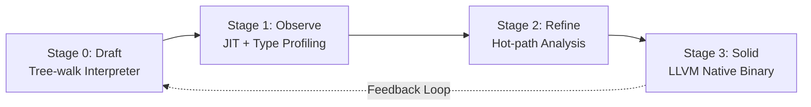
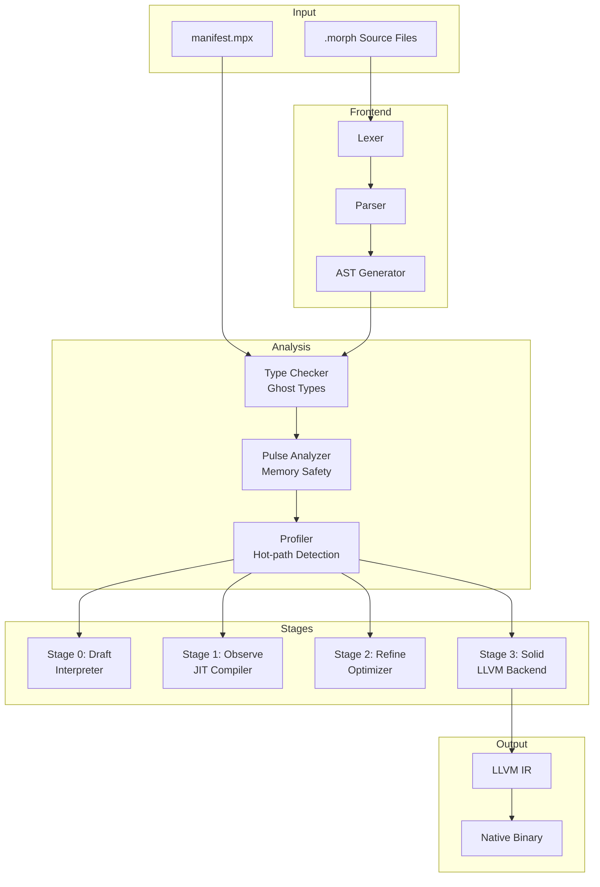
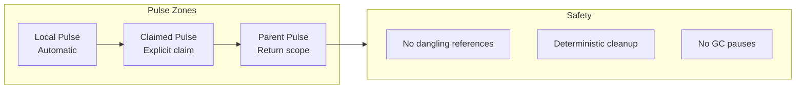
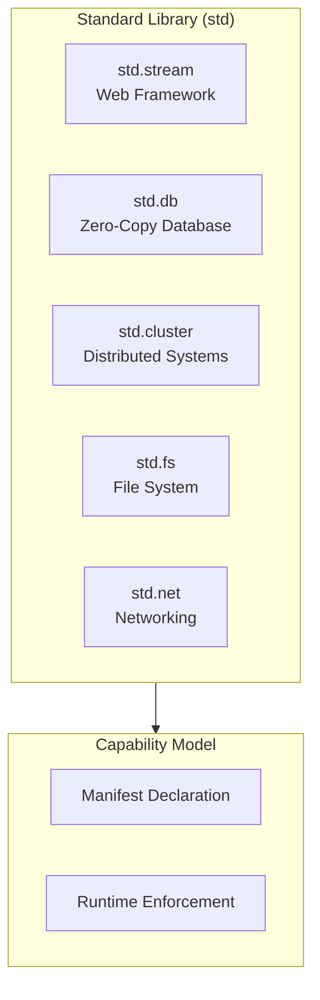
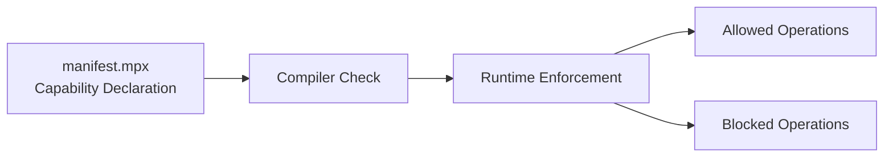

# Morph Language Architecture

## Overview

Morph is a multi-stage programming language that eliminates the "Two-Language Problem" by allowing developers to prototype with Python-like fluidity while deploying with C++/Rust-level performance.

## Core Philosophy: The Morphing Lifecycle

Morph exists on a spectrum of 4 performance stages:

| Stage | Mode | Technology | Performance Target |
|-------|------|------------|-------------------|
| **0: Draft** | proto | Tree-walk Interpreter | Prototyping (Python-equiv) |
| **1: Observe** | proto | JIT + Type Profiling | Scripting (JS-equiv) |
| **2: Refine** | Transition | Hot-path Analysis | Optimization Phase |
| **3: Solid** | solid | LLVM Native Binary | Systems (C/Rust-equiv) |



## Compiler Architecture (mrc)

### High-Level Architecture



### Core Components

#### 1. Lexer (Tokenizer)
- **Purpose**: Convert source code into tokens
- **Key Tokens**:
  - Keywords: `proto`, `solid`, `type`, `flow`, `let`, `var`, `if`, `else`, `match`, `for`, `in`, `return`, `claim`, `delegate`, `solve`, `ensure`, `log`
  - Operators: `|>` (pipe), `=>` (match arm), `..` (range)
  - Delimiters: `{`, `}`, `(`, `)`, `[`, `]`, `<`, `>`

#### 2. Parser
- **Purpose**: Build Abstract Syntax Tree (AST) from tokens
- **Grammar Features**:
  - Function declarations (`proto` / `solid`)
  - Pipe operator chaining
  - Match expressions
  - Solve blocks
  - Ghost type annotations

#### 3. AST (Abstract Syntax Tree)
- **Purpose**: Intermediate representation for analysis and compilation
- **Key Nodes**:
  - `FunctionDecl` (proto/solid modes)
  - `PipeExpr` (|> operator)
  - `MatchExpr` (pattern matching)
  - `SolveBlock` (declarative constraints)
  - `GhostType` (metadata annotations)

#### 4. Type System: Ghost Types

Ghost Types provide zero-cost abstractions:

```mermaid
flowchart TB
    subgraph GhostType["Ghost Type System"]
        GT1[Validation in Draft]
        GT2[Metadata Stripping]
        GT3[Byte-offset in Solid]
    end

    SRC[type Email = String<Ghost: "Regex", pattern: "^.+@.+$">] --> GT1
    GT1 --> GT2 --> GT3
```

**Features**:
- Runtime validation in proto mode
- Compile-time optimization in solid mode
- Metadata stripped during hardening

#### 5. Memory Management: Temporal Pulse Memory (TPM)



**Key Concepts**:
- `claim` keyword: Transfer ownership to parent scope
- Pulse zones: Scoped memory regions
- No traditional GC: Deterministic cleanup

## Multi-Stage Execution Model

### Stage 0: Draft (Tree-walk Interpreter)
- **Mode**: `proto`
- **Use Case**: Rapid prototyping
- **Characteristics**:
  - Dynamic typing
  - Interpreted execution
  - Maximum flexibility
  - Ghost type validation enabled

### Stage 1: Observe (JIT + Type Profiling)
- **Mode**: `proto`
- **Use Case**: Scripting with profiling
- **Characteristics**:
  - JIT compilation for hot paths
  - Type profiling collects runtime data
  - Stability scoring begins

### Stage 2: Refine (Hot-path Analysis)
- **Mode**: Transition
- **Use Case**: Optimization phase
- **Characteristics**:
  - Analyzes profiling data
  - Identifies optimization opportunities
  - Prepares for hardening

### Stage 3: Solid (LLVM Native Binary)
- **Mode**: `solid`
- **Use Case**: Production deployment
- **Characteristics**:
  - Static typing enforced
  - LLVM backend generates native code
  - Zero-cost abstractions
  - Maximum performance

## Standard Library Architecture



### Modules

1. **std.stream**: Web framework with routing
2. **std.db**: Memory-mapped database with zero-copy
3. **std.cluster**: Distributed task delegation
4. **std.fs**: File system operations (capability-gated)
5. **std.net**: Networking (capability-gated)

## Security: Capability Model



**Features**:
- Explicit capability declaration in manifest
- Compile-time verification
- Runtime sandboxing

## CLI Interface (mrc)

| Command | Purpose |
|---------|---------|
| `mrc run <file>` | Dynamic execution (Stage 0-1) |
| `mrc status` | Check Stability Scores |
| `mrc harden <file>` | Native compilation (Stage 3) |
| `mrc build` | Package solid fragments |

## Project Directory Structure

```
morph/
├── README.md
├── plans/
│   └── architecture.md
├── src/
│   ├── main.rs                 # CLI entry point
│   ├── lexer/
│   │   ├── mod.rs
│   │   ├── token.rs
│   │   └── tokenizer.rs
│   ├── parser/
│   │   ├── mod.rs
│   │   ├── ast.rs
│   │   └── parser.rs
│   ├── types/
│   │   ├── mod.rs
│   │   ├── ghost.rs
│   │   └── checker.rs
│   ├── pulse/
│   │   ├── mod.rs
│   │   ├── analyzer.rs
│   │   └── memory.rs
│   ├── stages/
│   │   ├── mod.rs
│   │   ├── draft.rs            # Stage 0
│   │   ├── observe.rs          # Stage 1
│   │   ├── refine.rs           # Stage 2
│   │   └── solid.rs            # Stage 3
│   ├── stdlib/
│   │   ├── mod.rs
│   │   ├── stream.rs
│   │   ├── db.rs
│   │   └── cluster.rs
│   └── cli/
│       ├── mod.rs
│       └── commands.rs
├── tests/
│   ├── lexer_tests.rs
│   ├── parser_tests.rs
│   └── integration_tests.rs
├── examples/
│   └── hello.morph
└── Cargo.toml
```

## Implementation Strategy

### Phase 1: Foundation
1. Lexer and basic tokenization
2. Parser with core grammar
3. AST representation
4. Basic interpreter (Stage 0)

### Phase 2: Type System
1. Ghost Types implementation
2. Type checker
3. Type inference

### Phase 3: Memory Management
1. Pulse Memory system
2. Ownership tracking
3. `claim` keyword implementation

### Phase 4: Stages
1. JIT compiler (Stage 1)
2. Profiler and hot-path detection (Stage 2)
3. LLVM backend (Stage 3)

### Phase 5: Standard Library
1. Core modules
2. Capability system
3. Security enforcement

### Phase 6: Tooling
1. CLI implementation
2. Package manager
3. IDE support

## Key Design Decisions

1. **Rust as Implementation Language**: Memory safety, performance, LLVM integration
2. **Gradual Typing**: Dynamic in proto, static in solid
3. **No Traditional Loops**: `for` with guards instead of `while/break/continue`
4. **Expression-Oriented**: Everything returns a value
5. **Pipe-First**: Left-to-right data flow as primary composition mechanism
