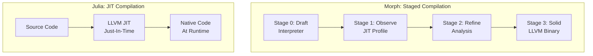
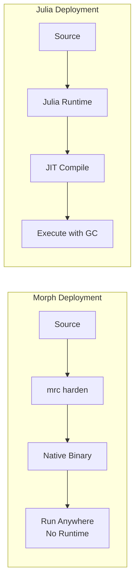

# Morph vs Julia: A Comparative Analysis

## Overview

Both Morph and Julia aim to solve the "Two-Language Problem" - the need to prototype in a high-level language (Python/MATLAB/R) and rewrite in a low-level language (C/C++/Fortran) for performance. However, they take fundamentally different approaches.

## Similarities

| Aspect | Morph | Julia |
|--------|-------|-------|
| **Goal** | Eliminate two-language problem | Eliminate two-language problem |
| **Prototyping** | High-level, dynamic (proto mode) | High-level, dynamic (REPL) |
| **Performance** | Can reach C/Rust speeds (solid mode) | Can reach C speeds (optimized) |
| **Type System** | Gradual typing | Gradual typing |
| **Multiple Dispatch** | Supported via pattern matching | Core language feature |
| **Metaprogramming** | Solve blocks, Ghost Types | Macros, generated functions |

## Key Differences

### 1. Compilation Strategy



**Morph**:
- Explicit staging: Developer chooses when to "harden" code
- Clear boundary between dynamic (`proto`) and static (`solid`) modes
- Ahead-of-time compilation to native binaries
- No runtime compilation overhead in production

**Julia**:
- Transparent JIT: Compilation happens automatically at runtime
- Functions compiled on first call with given type signatures
- "Time-to-first-plot" problem due to JIT warmup
- Always JIT-compiled, no explicit AOT option

### 2. Memory Management

| Feature | Morph | Julia |
|---------|-------|-------|
| **Model** | Temporal Pulse Memory (TPM) | Tracing Garbage Collector |
| **Determinism** | Deterministic cleanup | Non-deterministic (GC pauses) |
| **Control** | Explicit (`claim` keyword) | Implicit (GC handles it) |
| **Safety** | Compile-time ownership tracking | Runtime GC safety |
| **Performance** | Zero-cost, no GC pauses | GC pauses possible |

**Morph's TPM**:
```morph
proto process_data(input) {
    let items = json.parse(input)  // Local Pulse
    var output = []
    for item in items {
        let temp = item.val * 1.5
        output.push(claim temp)    // Explicit ownership transfer
    }
    return output  // Parent Pulse returned
}
```

**Julia's GC**:
```julia
function process_data(input)
    items = JSON.parse(input)  # GC-managed
    output = []
    for item in items
        temp = item.val * 1.5
        push!(output, temp)      # GC handles memory
    end
    return output
end
```

### 3. Type System Philosophy

| Aspect | Morph | Julia |
|--------|-------|-------|
| **Type Inference** | Yes, with Ghost Types | Yes, sophisticated |
| **Type Stability** | Enforced in `solid` mode | Recommended for performance |
| **Generic Programming** | Ghost Types + pattern matching | Multiple dispatch |
| **Zero-Cost Abstractions** | Ghost Types stripped at compile | Type specialization at runtime |

**Morph Ghost Types**:
```morph
type Email = String <Ghost: "Regex", pattern: "^.+@.+$">
# Validation in proto, stripped in solid
type Vertex = { pos: Vec3, uv: Vec2 } <Ghost: "Buffer_Layout_Packed">
# Metadata for optimization
```

**Julia Type Parameters**:
```julia
struct Email <: AbstractString
    value::String
    # Validation at construction
end

struct Vertex{P<:AbstractVector, U<:AbstractVector}
    pos::P  # Type specialization
    uv::U
end
```

### 4. Control Flow

| Feature | Morph | Julia |
|---------|-------|-------|
| **While loops** | ❌ Not available | ✅ Available |
| **Break/Continue** | ❌ Not available | ✅ Available |
| **Pattern Matching** | ✅ Native `match` expression | ✅ Via `Match.jl` package |
| **Pipe Operator** | ✅ Built-in `\|>` | ✅ Available via `Pipe.jl` |
| **For loops** | ✅ With guards (`where`) | ✅ Standard |

**Morph's Intent-First Control Flow**:
```morph
# Guards instead of continue
for item in items where !item.bad {
    process(item)
}

# Match instead of complex if-else
let grade = match score {
    90..100 => "A",
    80..89  => "B",
    _       => "C"
}
```

**Julia's Traditional Control Flow**:
```julia
# Traditional continue
for item in items
    item.bad && continue
    process(item)
end

# If-else chain
grade = if score >= 90
    "A"
elseif score >= 80
    "B"
else
    "C"
end
```

### 5. Syntax Design

| Aspect | Morph | Julia |
|--------|-------|-------|
| **Style** | Intent-First, pipe-oriented | Mathematical, array-oriented |
| **Function Definition** | `proto name(args) { }` | `function name(args) ... end` |
| **Immutability** | `let` (immutable), `var` (mutable) | `const` (global), default mutable |
| **Block Delimiters** | C-style `{ }` | `begin ... end` or indentation |
| **String Interpolation** | `"Hello {name}"` | `"Hello $name"` |

**Morph Example**:
```morph
proto calculate_stats(data) {
    data 
    |> filter(x => x > 0)
    |> map(x => x * 2)
    |> reduce((a, b) => a + b)
    |> log
}
```

**Julia Example**:
```julia
function calculate_stats(data)
    data |> 
        (x -> filter(>(0), x)) |>
        (x -> map(x -> x * 2, x)) |>
        (x -> reduce(+, x)) |>
        println
end
```

### 6. Standard Library & Ecosystem

| Aspect | Morph | Julia |
|--------|-------|-------|
| **Maturity** | 🆕 New (specification phase) | 🟢 Mature (10+ years) |
| **Package Ecosystem** | None yet | 10,000+ registered packages |
| **Web Framework** | `std.stream` (planned) | Genie.jl, Franklin.jl |
| **Data Science** | Planned | DataFrames.jl, Plots.jl, etc. |
| **ML/DL** | Planned | Flux.jl, MLJ.jl, etc. |
| **Interoperability** | C/C++ via LLVM | C, Python, R, Fortran |

### 7. Deployment Model



**Morph**:
- Compiles to standalone native binaries
- No runtime dependency
- Suitable for embedded systems, CLI tools, serverless
- Smaller deployment footprint

**Julia**:
- Requires Julia runtime
- Can use PackageCompiler.jl for sysimages
- Better for long-running processes
- Larger deployment footprint

### 8. Concurrency & Parallelism

| Feature | Morph | Julia |
|---------|-------|-------|
| **Async/Await** | `delegate` keyword | `@async`/`@sync` macros |
| **Distributed** | `std.cluster` module | Built-in `Distributed` module |
| **Threading** | Planned (LLVM) | `@threads` macro |
| **GPU** | Planned | CUDA.jl, AMDGPU.jl, etc. |

**Morph Distributed**:
```morph
proto distributed_task() {
    let cloud = cluster.join("my_cluster")
    for i in 0..1000 {
        delegate cloud.run(proto() {
            return perform_heavy_math(i)
        })
    }
}
```

**Julia Distributed**:
```julia
using Distributed
addprocs(4)

@distributed for i in 1:1000
    perform_heavy_math(i)
end
```

## When to Choose Which

### Choose Morph When:
- ✅ You need predictable, GC-free performance
- ✅ You want explicit control over optimization stages
- ✅ You're building CLI tools or embedded systems
- ✅ You prefer compile-time safety guarantees
- ✅ You want smaller deployment binaries
- ✅ You value deterministic memory management

### Choose Julia When:
- ✅ You need a mature ecosystem (data science, ML, etc.)
- ✅ You want interactive REPL-based development
- ✅ You're doing heavy numerical/scientific computing
- ✅ You need extensive package ecosystem
- ✅ You prefer automatic optimization
- ✅ You're doing exploratory data analysis

## Summary Table

| Criteria | Morph | Julia |
|----------|-------|-------|
| **Performance** | ⭐⭐⭐⭐⭐ (Native binary) | ⭐⭐⭐⭐ (JIT, near-C) |
| **Ease of Use** | ⭐⭐⭐ (New syntax) | ⭐⭐⭐⭐⭐ (Familiar, MATLAB-like) |
| **Ecosystem** | ⭐ (None yet) | ⭐⭐⭐⭐⭐ (Rich, mature) |
| **Memory Safety** | ⭐⭐⭐⭐⭐ (Ownership) | ⭐⭐⭐⭐ (GC, type safety) |
| **Deployment** | ⭐⭐⭐⭐⭐ (Native binary) | ⭐⭐⭐ (Runtime required) |
| **Interactivity** | ⭐⭐⭐ (REPL planned) | ⭐⭐⭐⭐⭐ (Excellent REPL) |
| **Learning Curve** | ⭐⭐⭐ (New concepts) | ⭐⭐⭐⭐ (Familiar to scientists) |

## Conclusion

**Morph** is a forward-looking language that prioritizes:
- Compile-time safety and optimization
- Deterministic performance (no GC)
- Clear staging between prototype and production
- Smaller deployment footprint

**Julia** is a mature language that prioritizes:
- Interactive development experience
- Rich scientific computing ecosystem
- Automatic optimization
- Ease of use for domain experts

Morph could be seen as "Julia with explicit staging and Rust-like memory safety" - trading some interactivity for predictability and deployment simplicity.
